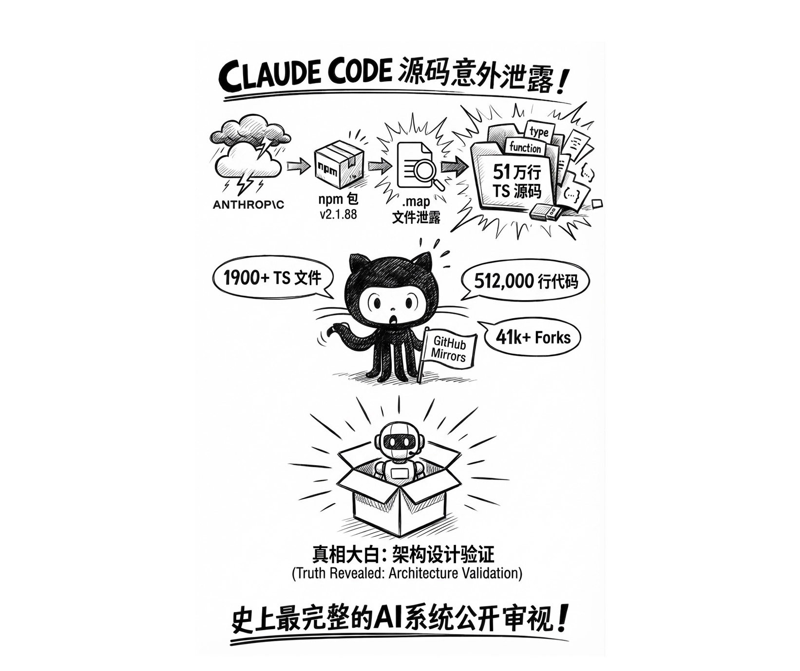
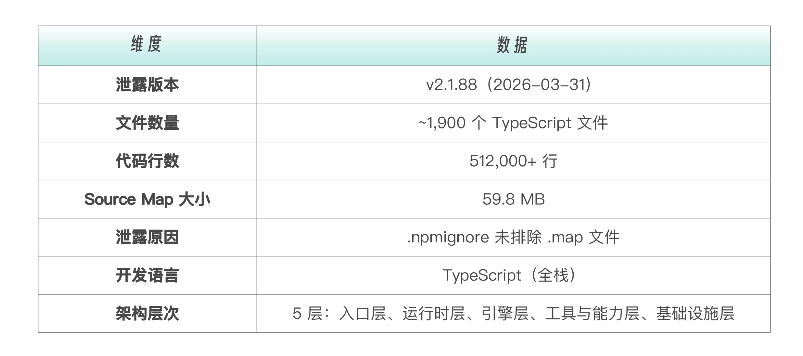
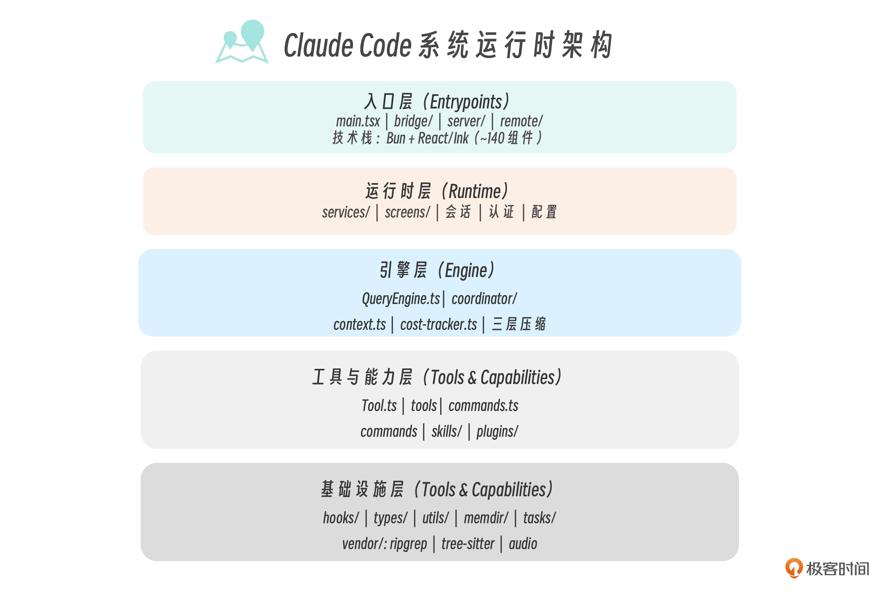
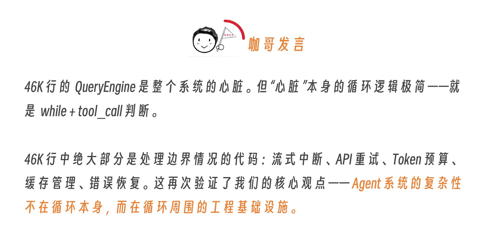
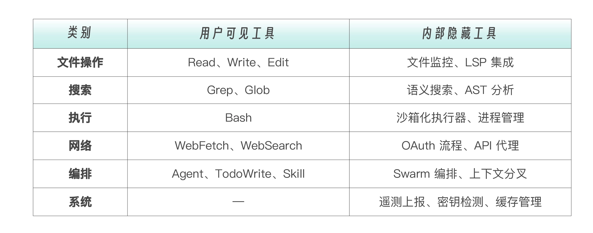

昨天（2026 年 3 月 31 日），有人发现  `@anthropic-ai/claude-code`  的 v2.1.88 npm 包中包含了一个不该出现的文件——`cli.js.map`。这是一份  source map，本用于内部调试，它能将编译后的混淆代码精确映射回原始的 TypeScript 源文件。

Anthropic 随后撤下了该版本，发表声明“这是一个由人为失误导致的打包问题，不涉及安全漏洞，不涉及客户数据或凭证”。但为时已晚——源码已被多个 GitHub 仓库镜像存档。


这不是一次“黑客攻击”。这是一次工程事故——一个  `.npmignore`  配置的疏忽。但它对我们的课程来说，是一次极其珍贵的验证机会。

从第 1 讲（全景认知）到最新的第 18 讲（工具系统），我们一直在黑箱外推测 Claude Code 的内部架构——通过官方文档、行为观察、API 分析来还原它的设计逻辑。现在，源码摊在了面前。**我们的推测对了多少？有哪些出乎意料的发现？对 Harness 工程有什么新的启示？**

这一讲不是事件报道，而是**架构验证**。我把源码中最重要的发现，逐一映射回我们课程中讲过的每个模块。

泄露的规模与结构有多大，我们先看数字：

下面，我们从源码的级别来拆解，也借助 Claude Code 本身的强大代码分析功能，与课程一一对照。我总结出了 10 大发现。（除了这篇加餐，4 月 2 日我也应极客时间邀请做了一场“拆解 Claude Code 源码中的企业级 AI 落地密码”的直播，直播回放链接在这里 https://live.geekbang.org/room/2508 ）


# 一、Claude Code 的确是五层架构式设计

我们课程第一讲中就指出 Claude Code 不是“一个 CLI 工具”，——它是一个**平台运行时**，终端 CLI 只是它的入口之一。同一个引擎核心驱动着桌面 App、Web 客户端、IDE 扩展和编程 SDK。

我们课程第一讲的架构图是基于行为观察和文档推断画出来的。现在源码的目录结构给出了最直接的证据——四个独立入口模块、140 个 UI 组件、三个预编译原生二进制。这个定位完全正确。直接把源码目录结构摊开，可以逐层验证：
```markdown
src/
├── main.tsx                 ← 入口层：Commander.js CLI 解析 + React/Ink 渲染
├── bridge/                  ← 入口层：IDE 集成桥接（VS Code / JetBrains）
├── server/                  ← 入口层：Server 模式（供桌面 App / Web 调用）
├── remote/                  ← 入口层：远程会话
│
├── services/                ← 运行时层：外部服务集成
├── screens/                 ← 运行时层：全屏 UI（认证、配置等）
├── components/              ← 运行时层：~140 个 Ink UI 组件
│
├── QueryEngine.ts           ← 引擎层：46KB（约 1,200 行），LLM 调用 / 流式 / 缓存 / 编排
├── coordinator/             ← 引擎层：多 Agent 编排（Coordinator Mode）
├── context.ts               ← 引擎层：系统/用户上下文收集
├── cost-tracker.ts          ← 引擎层：Token 消耗追踪
│
├── Tool.ts                  ← 工具层：29KB（约 800 行），所有工具类型定义 + 权限 Schema
├── tools/                   ← 工具层：~40 个工具实现
├── commands/                ← 工具层：~85 个斜杠命令，25K 行
├── commands.ts              ← 工具层：命令注册中心
├── skills/                  ← 工具层：技能系统
├── plugins/                 ← 工具层：插件系统
│
├── hooks/                   ← 基础设施层：React Hooks（含权限检查）
├── types/                   ← 基础设施层：TypeScript 类型定义
├── utils/                   ← 基础设施层：工具函数
├── memdir/                  ← 基础设施层：持久化记忆目录
└── tasks/                   ← 基础设施层：任务管理
```

当然我们低估了工程化的程度：85 个命令、40 个工具、25K 行命令注册代码——这是一个**重度工程化的产品级系统**所应该有的。

我们先看几个架构中最关键的部分。

**技术栈选型——Bun + React/Ink**。 Claude Code 运行在  **Bun**  而非 Node.js 上（Anthropic 在 2026 年 3 月收购了 Bun 的母公司 Oven），终端 UI 用了  **React + Ink**  框架——本质上是用 React 组件树渲染终端文本界面。`components/`  目录下有约 140 个 Ink 组件——这个数量级说明 Claude Code 的终端交互绝不是简单的  `readline`  命令行，而是一个完整的声明式 UI 应用。我们课程中一直把 Claude Code 称为终端工具，这从技术精确性上低估了它。

入口层的分离架构。` main.tsx`、`bridge/`、`server/`、`remote/`  四个入口模块相互独立，但共享下面四层。这意味着，IDE 扩展通过  `bridge/` 接入时，走的是和 CLI 一模一样的 QueryEngine、同一套工具权限、同一套上下文管理。**不是 IDE 版是阉割版——是同一个引擎的不同门面**。

**vendor/ 目录暗藏的“原生依赖”**。本地包中  `vendor/`  目录包含了三个预编译二进制：`ripgrep`（代码搜索）、`tree-sitter-bash`（Bash AST 解析）、`audio-capture`（语音输入）。这说明 Claude Code 的 Grep 工具底层调用的是  **ripgrep**——Rust 写的高性能搜索工具，不是 Node.js 的文本匹配。这解释了为什么 Claude Code 搜索大型代码库时那么快。tree-sitter-bash 则用于在执行 Bash 命令前做语法解析——可能是权限检查和安全分析的一部分。

下面是从代码中分析出来的 Claude Code 的真实系统架构，和我们之前的拆解的确有很多不谋而合之处。—— 当然，我们之前是从使用者的角度拆解，这个则是实打实的系统运行时架构。



# 二、QueryEngine：18 讲里的 Agentic Loop，源码里叫什么？

第 18 讲 梳理 **Tools 工具系统**时，我们定义了 Agentic Loop 的核心模式——“推理 → 工具调用 → 结果回注 → 继续推理”。我们推测 Claude Code 用的是 “dumb loop, smart model” 的设计——循环本身极简，所有智能交给模型。

**源码启发**：如果我们看看 Claude Code 的源码，会发现业界对 Agentic Loop 核心模式的解读完全正确。不过，**源码实际上比我们描述得更精巧**。

源码中这个循环的核心不叫 AgentLoop——叫  **QueryEngine**。它是整个系统最大的单一模块，46,000 行 TypeScript。QueryEngine 是一个单例（singleton），拥有一个  `mutableMessages`  数组——**整个对话的唯一真相来源（single source of truth）**。


循环的核心实现用了  **generator 模式**：
```typescript
// 概念性伪代码，基于泄露源码的架构分析
async function* agentLoop(messages: Message[]): AsyncGenerator<Event> {
  while (true) {
    const response = await queryLLM(messages);

    for (const item of response.items) {
      if (item.type === 'text') {
        yield { type: 'text', content: item.text };
      }
      if (item.type === 'tool_use') {
        // 权限检查
        const approved = await checkPermission(item.tool, item.input);
        if (!approved) continue;

        // 执行工具
        const result = await executeTool(item.tool, item.input);
        messages.push({ role: 'tool_result', content: result });

        yield { type: 'tool_result', tool: item.tool, result };
      }
    }

    if (!response.hasToolCalls) break;  // 无工具调用 = 结束
  }
}
```

Generator 模式 相比传统的 while 循环或状态机，有哪些好处呢？

1. **天然的流式输出**，`yield`  每产生一个事件就推给 UI。
2. **中断是干净的**，用户按 Ctrl+C，generator 直接 return，无需清理状态机。
3. **预算控制是平凡的**，在 yield 之间检查 Token 消耗，超预算直接 return。
4. **工具调用是递归的**，子代理可以嵌套自己的 generator。

和先前的课程对照一下，我们在第 18 讲把这个循环讲对了，但漏掉了 generator 模式这个实现细节。这是一个值得补充的工程模式——如果你自己要实现 Agentic Loop，generator 比 while + state machine 更优雅。


# 三、40 个工具：被严重低估的工具规模

我们说 Claude Code 内置了约 15 个工具，覆盖五个原子操作（读、写、执行、联网、编排）。我们强调了“少而精”的设计哲学。

**源码启发**：实际有约 40 个工具。我们当时统计的 15 个，只是用户可见的工具。源码中还有大量内部工具不对外暴露。

源码揭示的工具分类如下表：

每个工具都是一个**离散的、权限门控的插件**。工具定义不是简单的函数签名——每个工具包含以下内容。

- JSON Schema 的参数定义
- 权限需求声明（哪些权限级别可以调用）
- 风险等级标注（是否需要用户审批）
- 输出格式规范（返回给模型的数据结构）
- 错误处理逻辑（重试策略、降级方案）

工具定义这么长，不是因为工具逻辑复杂，而是因为每个工具的**安全边界定义**极其详尽。这印证了一个工程经验，**功能代码和安全代码的比例大约是 1:3**。  实现一个工具可能 200 行，但定义它的权限边界、错误处理和输出规范需要 600 行。

“少而精”的哲学仍然成立——40 个工具中，用户直接交互的确实只有十几个。其余都是支撑性的内部工具，服务于安全、监控和系统管理。第 18 讲给出的“五个原子操作”的分类框架是对的，但规模严重低估了。

# 四、上下文工程：Sebastian Raschka 说“真正的秘密武器不是模型”

Sebastian Raschka（《Build a Large Language Model From Scratch》作者）在泄露当天发表了一篇分析文章，标题直接点出了核心洞察：**Claude Code’s Real Secret Sauce Isn’t the Model.**

源码验证了他的判断。Claude Code 在上下文构造上做了至少五项精密优化，这些优化解释了为什么同一个 Claude 模型在 Web UI 和 Claude Code 中表现天差地别。

## 优化一：Git 上下文自动加载。

每次提示构造时，Claude Code 自动注入当前 Git 分支名、主分支名、最近的 commit 记录和 diff。模型不需要你告诉它“你在哪个分支上”——Harness 已经替你说了。这就是为什么 Claude Code 能自然地执行  `git checkout -b feature/xxx`  而 Web UI 做不到。

## 优化二：静态 / 动态内容分界标记。

提示词中有一个 **boundary marker**，将静态内容（系统指令、工具定义、CLAUDE.md）和动态内容（对话历史）分开。静态部分走全局缓存——和 Codex CLI 的 Prompt Caching 策略异曲同工，但 Claude Code 在客户端就做了分界，而不是依赖 API 端推断。

## 优化三：文件读取去重。

如果你在一次会话中多次读取同一个文件且文件未变，Claude Code 不会重复将内容塞入上下文。它在客户端做了**内容哈希去重**——只有文件内容发生变化时才重新加载。

## 优化四：大结果落盘。

当工具返回结果超过一定大小（比如  `grep`  搜出了几千行）时，Claude Code 不会把完整结果塞进上下文——它把完整结果**写入临时文件**，上下文中只保留一段**摘要预览 + 文件引用路径**。模型可以在需要时通过 Read 工具读取完整内容。

## 优化五：LSP 集成。

源码中有一个 LSP（Language Server Protocol）工具——这是我们在课程中完全没提到的。LSP 让 Claude Code 能做**语义级的代码理解**：定义跳转、引用查找、调用层次分析。

这不是  `grep`  的文本匹配能替代的，`grep "functionName"`  会匹配注释和字符串，LSP 只匹配真正的符号引用。

```markdown
上下文构造流程：

Git 信息（分支、commit）──→ ┐
CLAUDE.md（项目规则）───→   │
系统提示词 + 工具定义──→   ├→ 静态区域（缓存）
                           │       ↓ boundary marker
对话历史（去重后）────→     ├→ 动态区域
工具结果（大结果落盘）──→   ┘
```

这五项优化中，“大结果落盘”最值得学习。很多人用 Claude Code 时遇到过“上下文爆了”的问题——原因往往是一次  grep  搜出了太多结果。源码告诉我们，**Claude Code 已经在做结果裁剪了——如果你还遇到上下文不够用，说明你的搜索条件太宽泛，不是工具的问题。**

另外，LSP 集成解释了一个长久以来的疑问：为什么 Claude Code 在处理大型 TypeScript 项目时特别准？因为它不只是在文本搜索，它在用编译器级别的语义理解。

# 五、Self-Healing Memory：远比预期复杂的记忆系统

第 2 讲 CLAUDE.md 记忆系统里，我们讲了三级记忆体系——用户级、项目级、本地级。CLAUDE.md 是核心载体。

源码揭示了 **“自愈式记忆”（Self-Healing Memory）** 架构，这是我们完全没预料到的，值得我们仔细琢磨一下。

三层结构：
```markdown
第一层：MEMORY.md（轻量索引）
  └── 每条记忆只有一行指针（~150 字符）
  └── 永远加载在上下文中
  └── 是"目录"，不是"内容"

第二层：Topic Files（主题文件）
  └── 实际的记忆内容存在独立文件中
  └── 按需加载，不一次性塞入上下文
  └── 类似数据库的"索引 + 数据页"分离

第三层：Raw Transcripts（原始记录）
  └── 对话原文从不完整回读
  └── 只通过 grep 检索特定标识符
  └── 类似日志系统的"只写不全读"
```

## “自愈”体现在哪里？

源码中有一条关键规则叫“Strict Write Discipline”——Agent 只有在成功写入文件之后，才更新 MEMORY.md 索引。如果写入失败，索引不更新，这避免了“索引指向不存在的内容”的一致性问题。

这本质上是数据库中的  **write-ahead logging（WAL）**  的逆向——先写数据，再写索引，确保索引永远指向有效内容。

