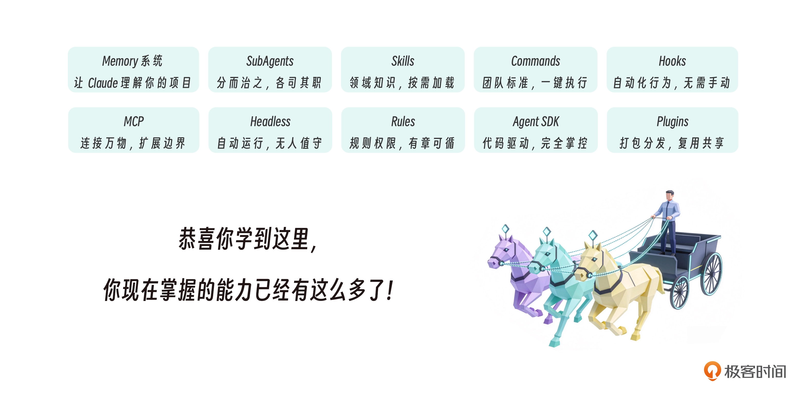

**第一部分：基础篇（第 1-2 讲）**

我们从 Claude Code 全景导览开始，理解了它不只是命令行助手，而是可扩展的 AI Agent 框架。然后学习了 CLAUDE.md 记忆系统，让 Claude 记住项目规范和团队约定。

**第二部分：子代理专题（第 3-8 讲）**

我们深入学习了子代理的核心概念，把“一个大脑”拆成多个“专职岗位”。通过代码审查员、测试运行器、日志分析器、多视角探索、Bug 修复流水线和 Agent Teams 等实战项目，掌握了隔离执行、权限边界和上下文管理。

**第三部分：Skills 技能系统（第 9-14 讲）**

我们理解了 SKILL.md 的触发机制——description 不是说明文档，而是触发器。学习了渐进式披露架构，用目录页、章节、附录三层结构把 token 利用率提升 98%。通过 API 生成器等项目，掌握了构建完整领域能力包的方法。最后，我们见证了 Skills 从 Claude Code 的产品特性出圈成为行业开放标准的过程。

**第四部分：核心组件和机制（第 15-18 讲）**

我们学习了 Hooks 实现事件驱动自动化（基础篇和高级篇），MCP 连接数据库、API 和第三方服务。这些扩展机制让 Claude Code 成为一个可编程、可定制的平台。

**第五部分：生产化与工程化（第 19-23 讲）**

我们学习了 Headless 模式让 Claude 在 CI/CD 中无人值守运行，Agent SDK 让你用代码驱动 AI 执行任务（基础篇和高级篇），最后用 Plugins 把所有能力打包成可复用的资产。

**你现在掌握的能力已经有这么多了！**

- **Memory 系统**：让 Claude 理解你的项目
- **SubAgents**：分而治之，各司其职
- **Skills**：领域知识，按需加载
- **Commands**：团队标准，一键执行
- **Hooks**：自动化行为，无需手动
- **MCP**：连接万物，扩展边界
- **Headless**：自动运行，无人值守
- **Rules**：规则权限，有章可循
- **Agent SDK**：代码驱动，完全掌控
- **Plugins**：打包分发，复用共享

**你已经从 Claude Code 的使用者成长为驾驭者。**

这门课程教给你的是框架和模式，真正的掌握来自实践。

佳哥在这里建议你：
1. **从小处开始**：做一个又一个项目，体验 Claude Code 的价值
2. **逐步深入**：遇到重复任务，尝试用子代理或 Skill 解决
3. **持续积累**：把好用的配置打包成插件，形成你的工具箱
4. **分享交流**：把你的插件和心得分享给团队或社区（咱们的群），在反馈中进步

AI 正在重塑软件开发的方式。Claude Code 不是要替代开发者，而是要**增强**开发者。它处理重复，你做创造；它执行任务，你做决策；它是工具，你是主人。人机协作的未来已经到来，而咱们已经准备好驾驭它。