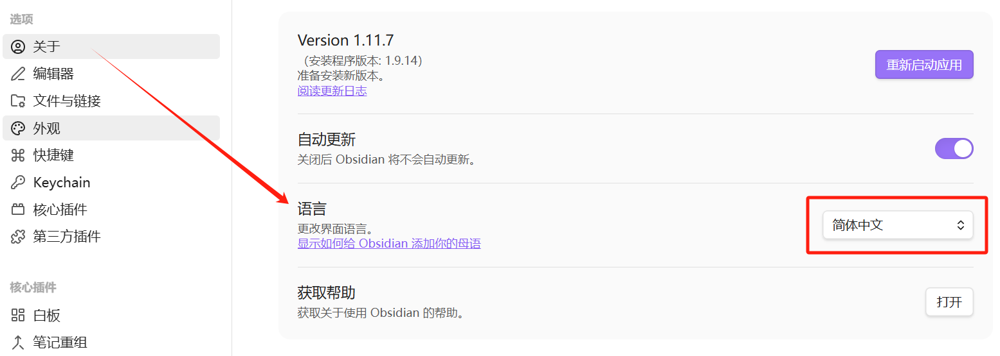
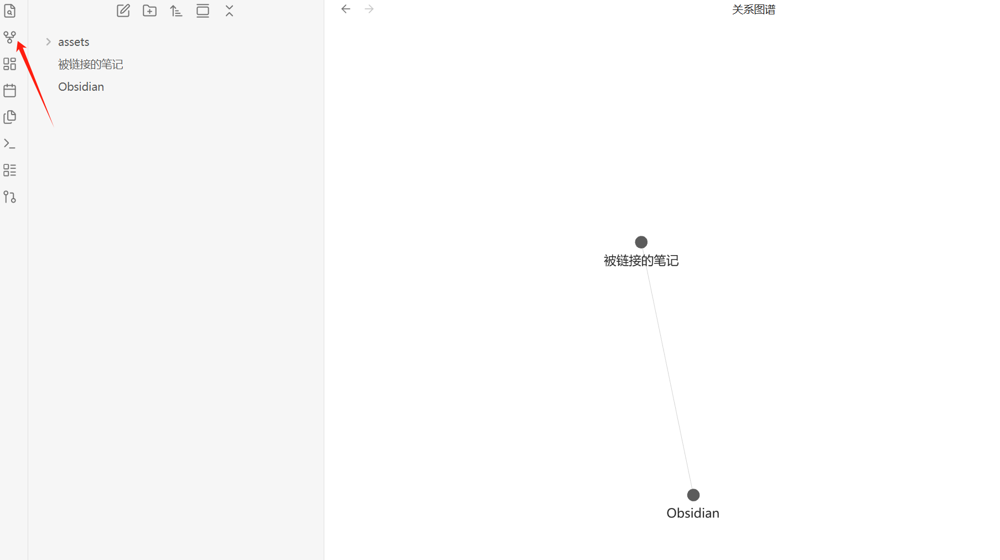
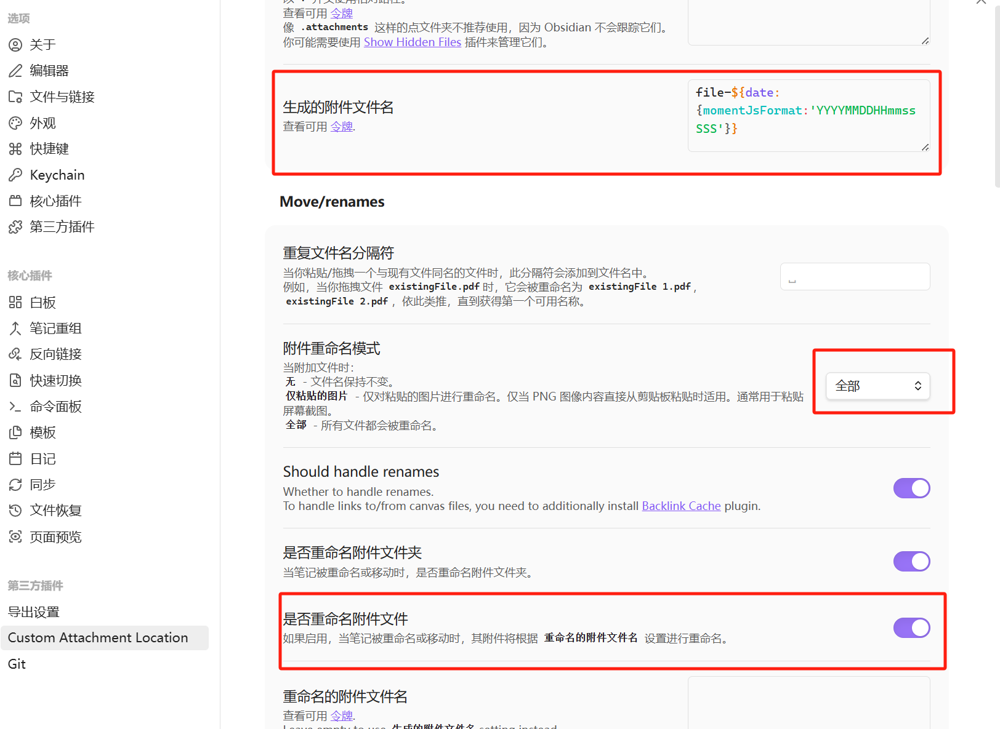
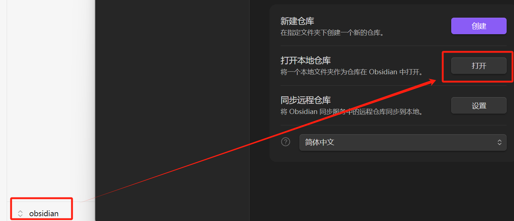
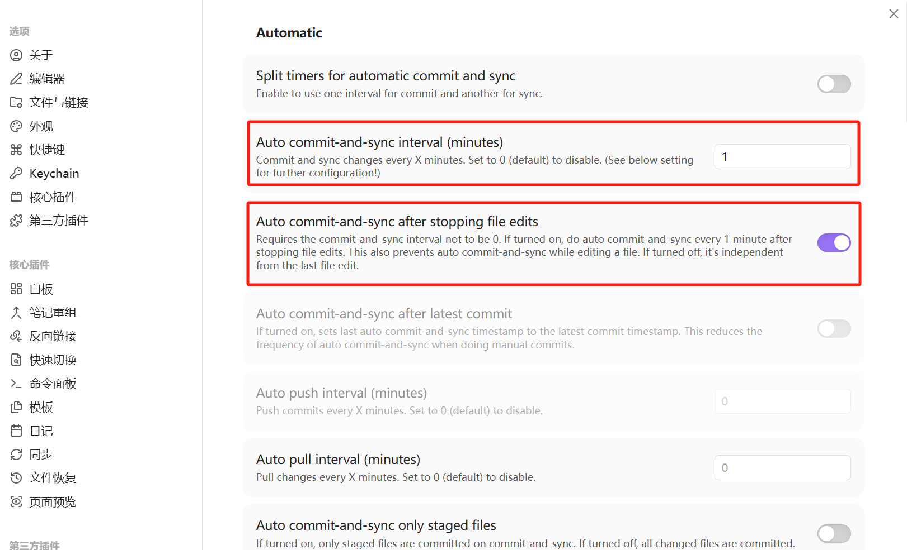
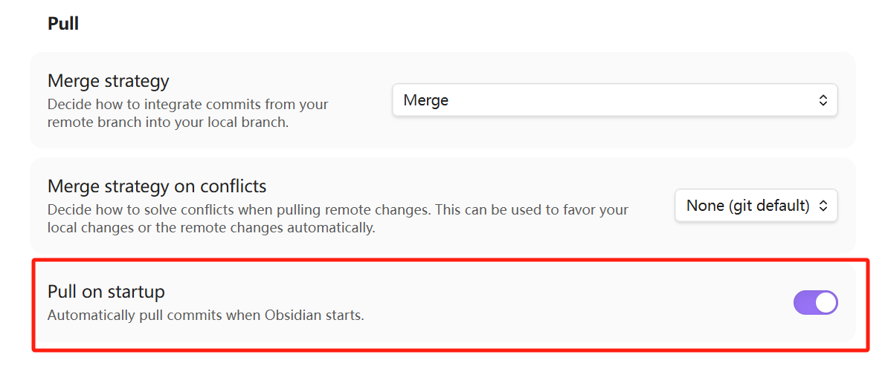

# 安装
下载安装包
或通过官网下载[https://obsidian.md]()

# 使用
## 设置语言

## 双向链接
可通过输入“[[]]“唤出要链接的笔记[被链接的笔记](被链接的笔记.md)，形成笔记间的链接关系，在侧边栏”查看关系图谱“查看全局链接关系

## Gemini辅助构建知识网络
如没有安装Gemini，参考文档安装：

# 插件
安装第三方插件前，先将安全模式关闭

### 图片保存
默认图片保存的目录和笔记同级，图片多了显得混乱，
社区插件市场-->浏览-->搜索Cunstom Attachment Location
按如下配置，图片保存统一归集到指定目录下

生成的附件文件填写：file-${date:{momentJsFormat:'YYYYMMDDHHmmssSSS'}}
附件全命名模式：全部
是否重命名附件文件：是

### 同步Github

选择左下角管理仓库，打开本地仓库，选择Github克隆的本地仓库地址

社区插件市场-->浏览-->搜索Git 安装
勾选自动提交，填写提交间隔时间，自动同步到Github

勾选 Pull On startup 在启动笔记时自动拉取远端文件
