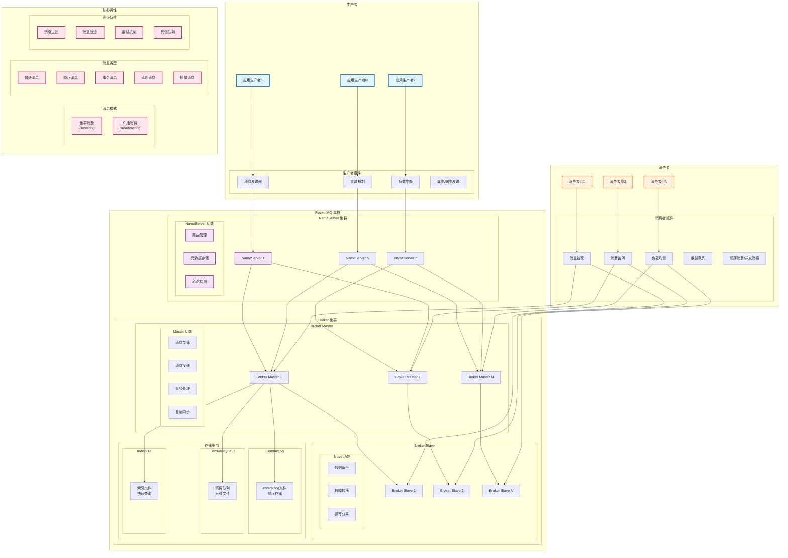
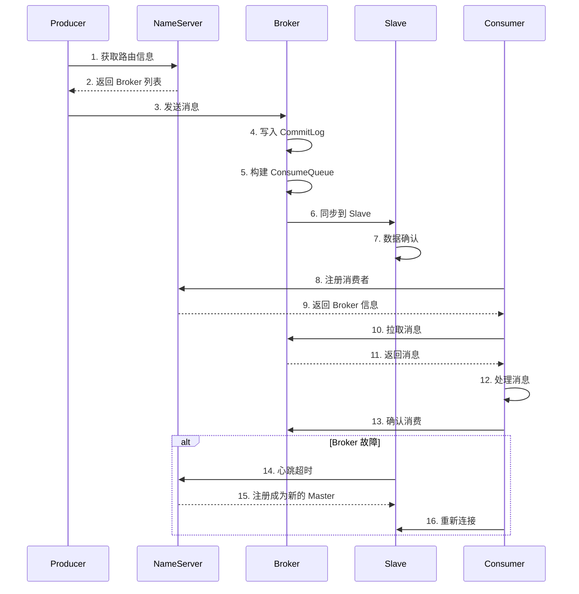
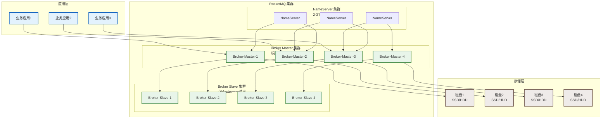
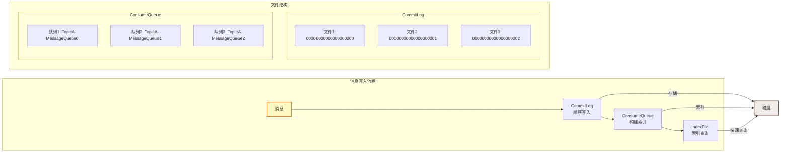

# RocketMQ 运行架构

## 核心架构图

```mermaid
graph TB
    subgraph "生产者"
        P1[应用生产者1]
        P2[应用生产者2]
        P3[应用生产者N]
        
        subgraph "生产者组件"
            PC1[消息发送器]
            PC2[负载均衡]
            PC3[重试机制]
            PC4[异步/同步发送]
        end
    end

    subgraph "RocketMQ 集群"
        subgraph "NameServer 集群"
            NS1[NameServer 1]
            NS2[NameServer 2]
            NS3[NameServer N]
            
            subgraph "NameServer 功能"
                N1[路由管理]
                N2[元数据存储]
                N3[心跳检测]
            end
        end

        subgraph "Broker 集群"
            subgraph "Broker Master"
                BM1[Broker Master 1]
                BM2[Broker Master 2]
                BM3[Broker Master N]
                
                subgraph "Master 功能"
                    BMF1[消息存储]
                    BMF2[消息投递]
                    BMF3[事务处理]
                    BMF4[复制同步]
                end
            end
            
            subgraph "Broker Slave"
                BS1[Broker Slave 1]
                BS2[Broker Slave 2]
                BS3[Broker Slave N]
                
                subgraph "Slave 功能"
                    BSF1[数据备份]
                    BSF2[故障转移]
                    BSF3[读写分离]
                end
            end
            
            subgraph "存储细节"
                subgraph "CommitLog"
                    CL[commitlog文件<br/>顺序存储]
                end
                subgraph "ConsumeQueue"
                    CQ[消费队列<br/>索引文件]
                end
                subgraph "IndexFile"
                    IF[索引文件<br/>快速查询]
                end
            end
        end
    end

    subgraph "消费者"
        C1[消费者组1]
        C2[消费者组2]
        C3[消费者组N]
        
        subgraph "消费者组件"
            CC1[消息拉取]
            CC2[消费监听]
            CC3[负载均衡]
            CC4[重试队列]
            CC5[顺序消费/并发消费]
        end
    end

    subgraph "核心特性"
        subgraph "消息模式"
            MP1[集群消费<br/>Clustering]
            MP2[广播消费<br/>Broadcasting]
        end
        
        subgraph "消息类型"
            MT1[普通消息]
            MT2[顺序消息]
            MT3[事务消息]
            MT4[延迟消息]
            MT5[批量消息]
        end
        
        subgraph "高级特性"
            AP1[消息过滤]
            AP2[消息轨迹]
            AP3[重试机制]
            AP4[死信队列]
        end
    end

    %% 连接关系
    P1 --> PC1
    P2 --> PC2
    P3 --> PC3
    
    PC1 --> NS1
    PC2 --> NS2
    PC3 --> NS3
    
    NS1 --> BM1
    NS2 --> BM2
    NS3 --> BM3
    NS1 --> BM2
    NS2 --> BM3
    NS3 --> BM1
    
    BM1 --> BS1
    BM2 --> BS2
    BM3 --> BS3
    
    BM1 --> CL
    BM1 --> CQ
    BM1 --> IF
    
    C1 --> CC1
    C2 --> CC2
    C3 --> CC3
    
    CC1 --> BM1
    CC2 --> BM2
    CC3 --> BM3
    
    CC1 --> BS1
    CC2 --> BS2
    CC3 --> BS3

    %% 样式
    classDef producer fill:#e1f5fe,stroke:#0277bd,stroke-width:2px
    classDef nameserver fill:#f3e5f5,stroke:#7b1fa2,stroke-width:2px
    classDef broker fill:#e8f5e9,stroke:#2e7d32,stroke-width:2px
    classDef consumer fill:#fff3e0,stroke:#ef6c00,stroke-width:2px
    classDef feature fill:#fce4ec,stroke:#c2185b,stroke-width:2px
    classDef storage fill:#e0f2f1,stroke:#00695c,stroke-width:2px

    class P1,P2,P3 producer
    class NS1,N2,N3,N1,N2,N3 nameserver
    class BM1,BM2,BM3,BM1,BMF1,BMF2,BMF3,BMF4,BS1,BS2,BS3,BSF1,BSF2,BSF3,CL,CQ,IF broker,storage
    class C1,C2,C3 consumer
    class MP1,MP2,MT1,MT2,MT3,MT4,MT5,AP1,AP2,AP3,AP4 feature
```

## 数据流向图

```mermaid
sequenceDiagram
    participant P as Producer
    participant NS as NameServer
    participant B as Broker
    participant S as Slave
    participant C as Consumer

    %% 生产者发送消息
    P->>NS: 1. 获取路由信息
    NS-->>P: 2. 返回 Broker 列表
    P->>B: 3. 发送消息
    B->>B: 4. 写入 CommitLog
    B->>B: 5. 构建 ConsumeQueue
    B->>S: 6. 同步到 Slave
    S->>S: 7. 数据确认

    %% 消费者拉取消息
    C->>NS: 8. 注册消费者
    NS-->>C: 9. 返回 Broker 信息
    C->>B: 10. 拉取消息
    B-->>C: 11. 返回消息
    C->>C: 12. 处理消息
    C->>B: 13. 确认消费

    %% 故障转移
    alt Broker 故障
        S->>NS: 14. 心跳超时
        NS-->>S: 15. 注册成为新的 Master
        C->>S: 16. 重新连接
    end
```

## 部署架构图

```mermaid
graph TB
    subgraph "应用层"
        A1[业务应用1]
        A2[业务应用2]
        A3[业务应用3]
    end

    subgraph "RocketMQ 集群"
        subgraph "NameServer 集群<br/>2-3节点"
            NS1[NameServer]
            NS2[NameServer]
            NS3[NameServer]
        end

        subgraph "Broker Master 集群<br/>根据业务需求部署"
            BM1[Broker-Master-1]
            BM2[Broker-Master-2]
            BM3[Broker-Master-3]
            BM4[Broker-Master-4]
        end

        subgraph "Broker Slave 集群<br/>与Master一一对应"
            BS1[Broker-Slave-1]
            BS2[Broker-Slave-2]
            BS3[Broker-Slave-3]
            BS4[Broker-Slave-4]
        end
    end

    subgraph "存储层"
        DISK1[磁盘1<br/>SSD/HDD]
        DISK2[磁盘2<br/>SSD/HDD]
        DISK3[磁盘3<br/>SSD/HDD]
        DISK4[磁盘4<br/>SSD/HDD]
    end

    %% 连接关系
    A1 --> BM1
    A2 --> BM2
    A3 --> BM3
    
    NS1 --> BM1
    NS2 --> BM2
    NS3 --> BM3
    NS1 --> BM2
    NS2 --> BM3
    NS3 --> BM4
    
    BM1 --> BS1
    BM2 --> BS2
    BM3 --> BS3
    BM4 --> BS4
    
    BM1 --> DISK1
    BM2 --> DISK2
    BM3 --> DISK3
    BM4 --> DISK4

    %% 样式
    classDef app fill:#e3f2fd,stroke:#1565c0,stroke-width:2px
    classDef nameserver fill:#f3e5f5,stroke:#6a1b9a,stroke-width:2px
    classDef broker fill:#e8f5e9,stroke:#2e7d32,stroke-width:2px
    classDef disk fill:#efebe9,stroke:#5d4037,stroke-width:2px

    class A1,A2,A3 app
    class NS1:NS2:NS3 nameserver
    class BM1,BM2,BM3,BM4,BS1,BS2,BS3,BS4 broker
    class DISK1,DISK2,DISK3,DISK4 disk
```

## 消息存储机制

```mermaid
graph LR
    subgraph "消息写入流程"
        MSG[消息] --> COMMITLOG[CommitLog<br/>顺序写入]
        COMMITLOG --> CONSUMEQUEUE[ConsumeQueue<br/>构建索引]
        CONSUMEQUEUE --> INDEX[IndexFile<br/>索引查询]
    end

    subgraph "文件结构"
        subgraph "CommitLog"
            direction TB
            FILE1[文件1: 00000000000000000000]
            FILE2[文件2: 00000000000000000001]
            FILE3[文件3: 00000000000000000002]
        end
        
        subgraph "ConsumeQueue"
            direction TB
            QUEUE1[队列1: TopicA-MessageQueue0]
            QUEUE2[队列2: TopicA-MessageQueue1]
            QUEUE3[队列3: TopicA-MessageQueue2]
        end
    end

    COMMITLOG -- 存储 --> DISK[磁盘]
    CONSUMEQUEUE -- 索引 --> DISK
    INDEX -- 快速查询 --> DISK

    %% 样式
    classDef message fill:#fff9c4,stroke:#f57f17,stroke-width:2px
    classDef storage fill:#e8eaf6,stroke:#3f51b5,stroke-width:2px
    classDef queue fill:#f1f8e9,stroke:#689f38,stroke-width:2px
    classDef disk fill:#efebe9,stroke:#5d4037,stroke-width:2px

    class MSG message
    class COMMITLOG,CONSUMEQUEUE,QUEUE1,QUEUE2,QUEUE3,INDEX storage,queue
    class DISK disk
```