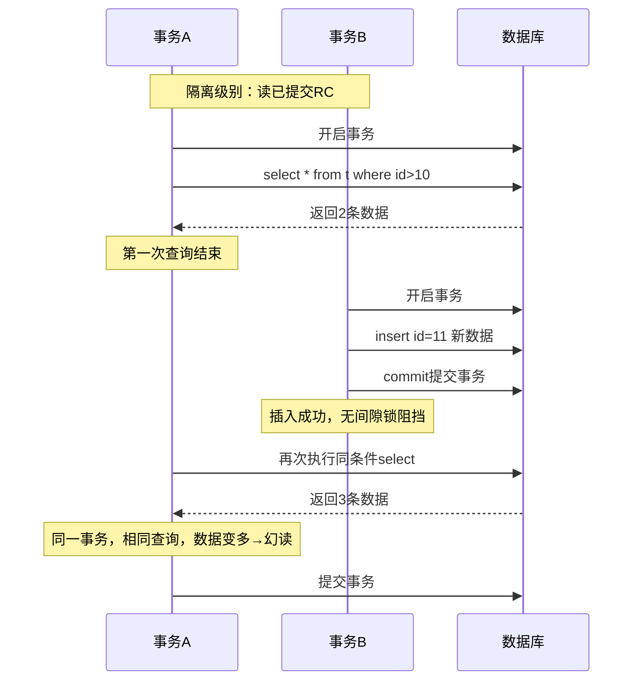
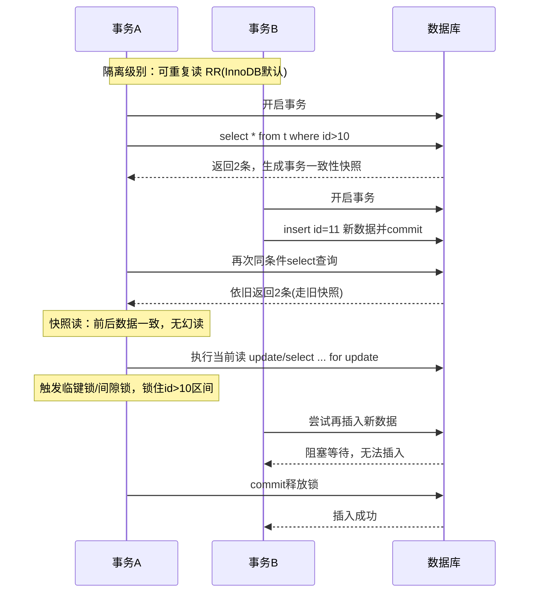

# 读已提交
## 时序流程图

## 出现幻读核心原因

1. **RC 每次 SELECT 都会重新读取最新已提交快照**，不是事务启动时固定快照
2. **RC 下 InnoDB 只有行锁，没有间隙锁**，区间空白处可随意插入数据
3. 只能屏蔽脏读，**无法阻止其他事务新增、删除数据**，必然产生幻读

## 可重复读 对比（解决幻读）

- RR：事务内**首次查询固定快照**，普通快照读无幻读
- RR + 当前读：**临键锁 + 间隙锁**锁住查询区间，禁止插入新数据，彻底杜绝幻读

# 可重复读
## 时序流程图

## 核心要点

1. **快照读**：事务启动后首次查询确立数据视图，全程复用，其他事务新增提交也看不到，避免幻读
2. **当前读**：加排他锁 + 间隙锁，直接锁住查询范围的空闲位置，从物理层面禁止插入新数据
3. RR 既解决不可重复读，也彻底杜绝幻读