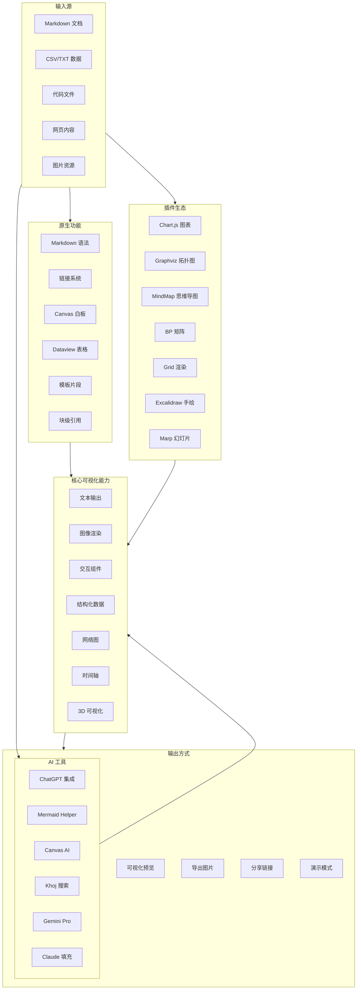

# Obsidian 可视化技能流程图（简化版）

## 图表说明
以下流程图展示了 Obsidian 中原生的可视化功能、丰富的插件生态系统以及 AI 工具的整合。

```mermaid
graph TB
    %% 输入源
    subgraph Input[输入源]
        A[Markdown 文档]
        B[CSV/TXT 数据]
        C[代码文件]
        D[网页内容]
        E[图片资源]
    end

    %% 原生功能
    subgraph Native[原生功能]
        F[Markdown 语法]
        G[链接系统]
        H[Canvas 白板]
        I[Dataview 表格]
        J[模板片段]
        K[块级引用]
    end

    %% 插件生态
    subgraph Plugins[插件生态]
        L[Chart.js 图表]
        M[Graphviz 拓扑图]
        N[MindMap 思维导图]
        O[BP 矩阵]
        P[Grid 渲染]
        Q[Excalidraw 手绘]
        R[Marp 幻灯片]
    end

    %% AI 工具
    subgraph AI[AI 工具]
        S[ChatGPT 集成]
        T[Mermaid Helper]
        U[Canvas AI]
        V[Khoj 搜索]
        W[Gemini Pro]
        X[Claude 填充]
    end

    %% 核心能力
    subgraph Core[核心可视化能力]
        Y[文本输出]
        Z[图像渲染]
        AA[交互组件]
        AB[结构化数据]
        AC[网络图]
        AD[时间轴]
        AE[3D 可视化]
    end

    %% 输出方式
    subgraph Output[输出方式]
        AF[可视化预览]
        AG[导出图片]
        AH[分享链接]
        AI[PDF/HTML]
        AJ[演示模式]
    end

    %% 连接关系
    Input --> Native
    Input --> Plugins
    Input --> AI
    
    Native --> Core
    Plugins --> Core
    AI --> Core
    
    Core --> Output

    %% 样式定义
    classDef Input fill:#fee2e2,stroke:#dc2626
    classDef Native fill:#e5f3ff,stroke:#3182ce
    classDef Plugins fill:#f0fdf4,stroke:#16a34a
    classDef AI fill:#fef3c7,stroke:#d97706
    classDef Core fill:#f3e8ff,stroke:#7c3aed
    classDef Output fill:#dcfce7,stroke:#16a34a
```