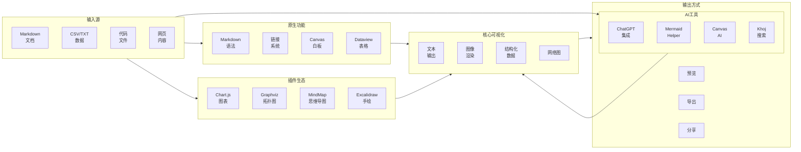

# Obsidian 可视化技能流程图（紧凑版）

## 图表说明
以下流程图展示了 Obsidian 中原生的可视化功能、插件生态系统和 AI 工具的整合。

```mermaid
graph LR
    %% 左侧输入
    subgraph Input[输入源]
        A[Markdown<br>文档]
        B[CSV/TXT<br>数据]
        C[代码<br>文件]
        D[网页<br>内容]
    end

    %% 中间能力层
    subgraph Native[原生功能]
        F[Markdown<br>语法]
        G[链接<br>系统]
        H[Canvas<br>白板]
        I[Dataview<br>表格]
    end

    subgraph Plugins[插件生态]
        L[Chart.js<br>图表]
        M[Graphviz<br>拓扑图]
        N[MindMap<br>思维导图]
        O[Excalidraw<br>手绘]
    end

    subgraph AI[AI工具]
        S[ChatGPT<br>集成]
        T[Mermaid<br>Helper]
        U[Canvas<br>AI]
        V[Khoj<br>搜索]
    end

    %% 右侧输出
    subgraph Core[核心可视化]
        Y[文本<br>输出]
        Z[图像<br>渲染]
        AB[结构化<br>数据]
        AC[网络图]
    end

    subgraph Output[输出方式]
        AF[预览]
        AG[导出]
        AH[分享]
        AI[演示]
    end

    %% 连接关系 - 横向流动
    Input --> Native
    Input --> Plugins
    Input --> AI
    
    Native --> Core
    Plugins --> Core
    AI --> Core
    
    Core --> Output

    %% 样式定义
    classDef Input fill:#ffe3e3,stroke:#e53e3e
    classDef Native fill:#e6f3ff,stroke:#3182ce
    classDef Plugins fill:#e6fffa,stroke:#38b2ac
    classDef AI fill:#fff5b4,stroke:#d69e2e
    classDef Core fill:#f6e6ff,stroke:#805ad5
    classDef Output fill:#d4f4dd,stroke:#48bb78
```