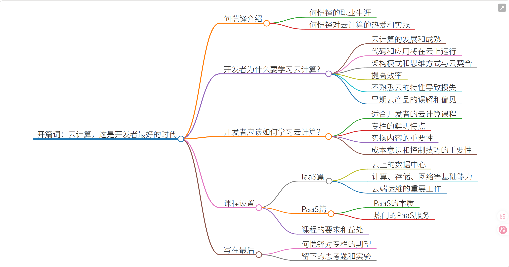

# 开发者为什么要学习云计算？

云计算，不仅是一个妇孺皆知的技术热词，也早已成长为一个巨大的行业。根据 Gartner 的报告，全球公共云服务市场在 2019 年已经突破两千亿美元。毫无疑问，历经多年的发展和成熟，云计算已经成为一种潮流，也是现代企业数字化转型中的重要组成部分。

**产业的发展必然影响个体。那么，问题来了，这一趋势对于我们开发者而言意味着什么？**

这意味着，**未来我们的代码，和我们构建的应用，将越来越多地运行在云上**；它还意味着，**我们的架构模式和思维方式，将更多地与云契合共生**。因此，我们必须学习了解云，以适应在云上构建应用的新时代。

**另一个你应当学习云计算的原因，在于效率**。现代社会的节奏飞快，业务需求多如牛毛，而且瞬息万变。更快更稳定地构建和交付，成为开发者的核心竞争力。云就能够帮助你做到这一点，触手可及的庞大资源规模、高度自动化的各类服务、可重用的基础组件，都会是你提高效率的好帮手。

另外，在日常工作和社区交流中，我发现许多开发者对于语言、框架和类库都比较重视和了解，毕竟这是每天接触的工具。**但大家往往对于云的特性却还不够熟悉**，导致在资源配置、技术选型和架构设计等环节没有选择最佳的方案，造成稳定性或是成本上的损失。如果对云计算有足够的理解，这些损失是完全可以避免的。

还有一部分开发者，**在过去尝试过云计算的产品或服务，但由于早期云产品不成熟或者使用方式的问题，无意识地形成了一些误解甚至偏见**，比如出于思维惯性，会觉得云虚拟机的硬盘性能低下，但事实并非如此。要知道，云计算的发展并非一蹴而就，而是历经多年逐步发展成熟的。所以，在 2020 年，你也可能需要来刷新一下认知，了解云的最新能力与动态。

以上种种，共同构成了开发者应当认真对待和系统学习云计算的原因。这是云计算最好的时代。而在云的赋能下，这也应该是开发者最好的时代，是新时期优秀开发者的制胜之道。

# 开发者应该如何学习云计算？

那么，面对云计算这样一个宏大的课题，我们应该怎样入手学习呢？

市面上存在的云计算类书籍与课程，大致可分为这样几种：

- 一类是面向大众的科普书籍，侧重于云的历史发展和社会价值，技术上讲得不深；
- 一类是侧重于讲解虚拟化技术等云计算的内部实现，适合底层研发工程师而非应用开发者阅读；
- 还有一类常见的形式，则是云厂商自行制作的培训材料，其中不乏精品，但和某一个云绑定比较深，也总难免带上一些产品宣传痕迹。

我一直在想，能不能有更加适合开发者的云计算课程呢？毕竟，开发者才是云计算的最终用户啊。

所以，我希望这个专栏有所不同，有它的鲜明特点：

- 一方面，专栏会立足于开发者和架构师的视角来介绍云计算技术，尽可能多地结合应用场景来解析云的概念和能力，帮助你学习“用云”而非“做云”；
- 另一方面，专栏也会尽量不倾向于任何一个云，不进行“厂商绑定”，而是同时观察运用多个主流云厂商的服务，帮助你了解云的共性，也体会不同云的各自特点。

所以在我们的后续内容中，我们将同时以阿里云、AWS 和微软 Azure 为主要研究对象（因为这三家正是全球云计算三甲），再结合穿插腾讯云、华为云等优秀云服务作为案例进行讲解。如果你之前只是熟悉一个云，希望这样的方式也能够破除单个云的信息茧房，让你拥有更广阔的视野。

> 需要说明：这个专栏将以讲解公有云为主，私有云暂不涉及。不过不用担心，公有云和私有云的许多理念和实现都非常类似，颇有相通之处。所以这个课程对于你了解学习私有云也能有不小的帮助。

在每篇课程有限的篇幅中，我还会非常注意加入一些实操的内容，而非仅仅作概念解释和纸上谈兵。因为接地气的动手实验能帮助形成更直观的认识，和理性的解读一起参照，可以强化和加深对知识的理解。

另外，云和传统 IT 架构方面的一个显著差别在于成本：云的成本是非常动态的，会更多地由应用架构和技术选型所决定。换一句话说，云让我们开发者离钱更近了。因此我认为**成本**是云端的一个重要话题，所以成本意识和成本控制技巧也将贯穿这个课程的始终。毕竟，**能为公司和项目省下真金白银，和赚取利润同样关键。**

以上几点，是我觉得开发者在学习云计算时应有的要点，也正是我们这个专栏的定位和撰写思路了。

# 课程设置

我们知道，现代云计算是由大大小小、形态各异的云服务所组成。业界通行的做法，是将它们大致划分为 IaaS 和 PaaS 两个领域。

- **IaaS（Infrastructure as a Service），即“基础设施即服务”**，一般指云计算所提供的计算、存储、网络等基本底层能力；
- **PaaS（Platform as a Service），即“平台即服务”**，通常指基于云底层能力而构建的面向领域或场景的高层服务，如数据库、应用服务等。

> 注：广义上的云计算，还可包括 SaaS（Software as a Service，软件即服务）的内容，一般指基于云构建可开箱即用的各种业务应用。这是另一个宏大的领域，我们这个开发者课程就不予以关注和讨论了。

所以在专栏内容上面，我们的课程也会遵循这样的方式来划分，分为 IaaS 篇和 PaaS 篇，各自为你精心挑选了领域内最重要的若干话题。

- IaaS 篇，我会从云上的数据中心入手，然后分别讲解在云上如何让计算、存储、网络等基础能力为你所用。小到一台虚拟机的选择，大到云上架构的最佳实践，和整个数据中心的规划，都会有相关的讲解。最后，我们还会探讨云端运维有哪些重要的工作不可忽略。
- PaaS 篇，我们首先会探讨 PaaS 的本质，同时教你掌握 PaaS 最重要的几个观察视角，然后分别按篇章介绍那些最炙手可热的 PaaS 服务，像是云存储、云数据库、云容器服务、无服务器架构、云 AI 平台等等，这些你耳熟能详的云服务都会一一专门讨论，尤其会着重剖析它们与自建服务相比有何优势，以及适合的应用场景。

这个专栏并不会对你的先验知识有很高的要求，只要你有一定的计算机基础和研发经验，对体系结构、操作系统、数据库、编程语言等常见内容有一定了解就可以了。云计算本就是各领域技术的抽象和组合，所以全面系统地学习云计算对提升你的专业综合素养也是大有裨益的。

当然，作为一个力求“深入浅出”的课程，在覆盖了广度的前提下，篇幅所限，我无法去深度讲解每一个相关领域的基础知识。比如说，云数据库会是专栏的重要章节，但显然我不会去教授 MySQL 或者 PostgreSQL，你需要订阅其他专栏来学习这些数据库本身。不过，我会力求讲清每一个领域在云端的差异化特点和最佳实践。

# 写在最后

以上就是我对于自己以及这个专栏的介绍了。云计算其实并不困难，也没有那么神秘。只要你跟随专栏认真学习，我相信一定会有所收获。**你会对于云计算的产品和能力形成一个清晰的宏观认知；也会了解到一些重要细节和实践经验；最后也是最重要的，回到你自己的生产场景，你将能够判断和决定如何正确运用云的力量。**

所以，请坐稳扶好，我们马上就要启航了，方向：广阔云端。

